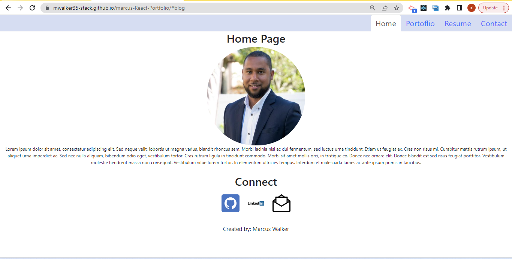

# React Portfolio
  
  ## Table of Contents:
  *[Description](#Description)

  *[Installation](#Installation)

  *[Usage](#Usage)

  *[License](#License)

  *[Contributing](#Contributing)

  *[Tests](#Tests)

  *[Questions](#Questions)

  ## Description: 
  Web application to showcase my projects, about me. 

  ## Installation:
  react

  ## Usage:
  To deploy updated app: npm run deploy
  If in node.js in index.js npm start 

  ## License:
  
   
  This application is covered by the GNUv3.0 license. 

  ## Contributing:
  myself

  ## Questions:
  If you have questions please Email: mwalke35@yahoo.com 
  See: GitHub:  (https://github.com/mwalker35-stack) 
  